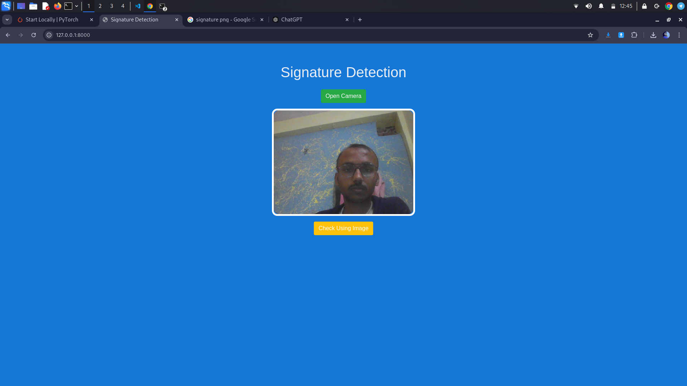
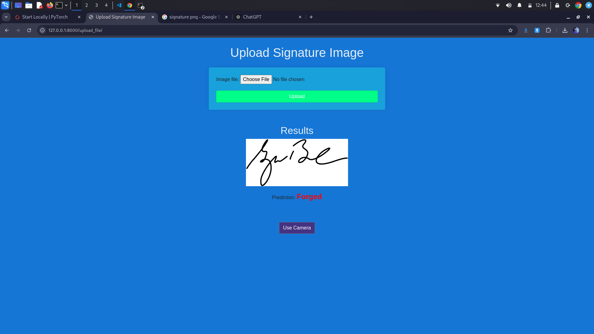

# Signature Authenticity Detection

This project aims to verify the authenticity of handwritten signatures using deep learning techniques. It uses PyTorch and Torchvision for model processing, and Django for building and serving the web application.

## Features
- **Signature Authentication:** Detect whether a signature is genuine or forged.
- **Deep Learning Model:** Utilizes a Convolutional Neural Network (CNN) model to analyze signatures, but training is handled externally or with pre-trained models.
- **Web Interface:** A user-friendly interface where users can upload signatures for verification.
- **Real-Time Feedback:** Provides instant feedback on the authenticity of the uploaded signature via the web interface.

## Technologies Used
- **Backend:** Django
- **Deep Learning Framework:** PyTorch, Torchvision
- **Frontend:** HTML, CSS, Bootstrap
- **Image Processing:** Matplotlib for visualization

## Setup Instructions

### Prerequisites
Ensure you have the following installed:
- Python 3.x
- Django
- PyTorch
- Torchvision
- Matplotlib

### Installation
1. Clone the repository:
   ```bash
   git clone https://github.com/yourusername/signature-authentication.git
   cd signature-authentication
   ```

2. Create a virtual environment:
   ```bash
   python -m venv env
   source env/bin/activate   # For macOS/Linux
   .\env\Scripts\activate    # For Windows
   ```

3. Install the dependencies:
   ```bash
   pip install -r requirements.txt
   ```

4. Run migrations for database setup:
   ```bash
   python manage.py migrate
   ```

5. Start the development server:
   ```bash
   python manage.py runserver
   ```

6. Navigate to `http://127.0.0.1:8000/` in your browser to access the app.


## Screenshots



## How to Use
- Users can upload a scanned image of a signature via the provided upload section.
- The Django backend will handle the signature verification in real-time without the need for additional deep learning training.
- The system will return whether the signature is genuine or forged.


## Contributing
If you'd like to contribute to this project:
1. Fork the repository.
2. Create a new branch for your feature (`git checkout -b feature-name`).
3. Commit your changes (`git commit -am 'Add new feature'`).
4. Push to the branch (`git push origin feature-name`).
5. Create a new pull request.

## License
This project is licensed under the MIT License - see the [LICENSE](LICENSE) file for details.

## Acknowledgments
- PyTorch, Torchvision, and Django for their powerful frameworks.
- Dataset sources for signature verification.
- Inspiration from various deep learning-based signature verification methods.
